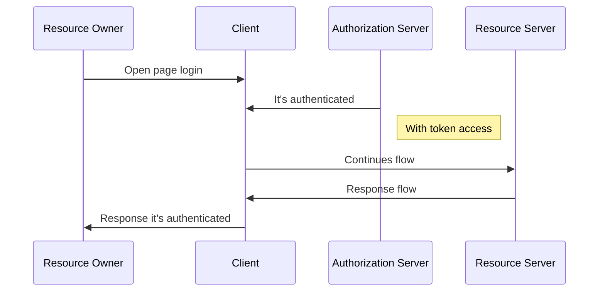

# IFTO - AUTH
This project is responsible for authorization server the project Application IFTO. 

## For Each
It's necessary to inform by Basic Authentication the `client_id` and `client_secret`.

## Request Token
It's necessary authentication by Post request to path `/oauth/token`
and information by `application/x-www-form-urlencoded` valid `username` and `password` values
and static field `grant_type` with value `password`.

- Token validate time: 15s 

## Refresh Token
It's necessary to Post request the path `/oauth/token`
and information by `application/x-www-form-urlencoded` the field `refresh_token`
and static field `grant_type` with value `refresh_token`.

- Refresh Token validate time: 30s

## Generated Key 
Open terminal in directory `resources/store/key` of the project and type down the command below:
 `keytool -genkeypair -alias oauth_ifto -keyalg RSA -keypass <YOUR_PASSWORD_KEYPASS> -keystore oauth_ifto.jks -storepass <YOUR_PASSWORD_STOREPASS> -validity 3650`
 Replace `<YOUR_PASSWORD_KEYPASS>` for your any secret.
 It's necessary set in environment `TOKEN_SECRET_STORE_PASS` value, with the same value as informed in `YOUR_PASSWORD_KEYPASS`
 Replace `<YOUR_PASSWORD_STOREPASS>` for your any secret.
 It's necessary set in environment `TOKEN_SECRET_PAIR_ALIAS` value, with the value `oauth_ifto`

## Sequence Diagram

## Author
- Victtor Freitas
